  

  
  
  
  
  
  

 

<table>
  <tr>
    <td width="58%" valign="top">
      <h2>Hi, I'm Mo, I build things that actually work.</h2>
      

        <b>Full-stack developer based in Athens.</b> I take messy problems and turn them into
        clean, working products: full-stack apps, automation pipelines, AI-powered tools,
        and e-commerce systems that people actually use.
      

      
      
      
      
      
      
      
      

        I care about clean structure, reliable data flows, and tools that save you time
        rather than add noise. If it ships and it works, I'm happy.
      

    </td>
    <td width="42%" valign="top">
      <h2>What I focus on</h2>
      
<code>01</code> <b>Full-Stack Development</b> APIs, dashboards, auth, databases, deployment, end to end

      
<code>02</code> <b>Automation &amp; Scraping</b> Bots, scrapers, data pipelines, workflows that run themselves

      
<code>03</code> <b>AI-Powered Tools</b> Practical AI features connected to real infrastructure

      
<code>04</code> <b>Open to Collaboration</b> I work best with people who want to ship, not just plan

    </td>
  </tr>
</table>

  

## Core Stack

  

 

<table>
  <tr>
    <td width="25%" align="center"><b>Full-Stack</b> React, Node.js, APIs, databases</td>
    <td width="25%" align="center"><b>Automation</b> n8n, scrapers, bots, pipelines</td>
    <td width="25%" align="center"><b>Mobile</b> Flutter, cross-platform apps</td>
    <td width="25%" align="center"><b>AI Integration</b> Useful features, not hype</td>
  </tr>
</table>

## GitHub Activity

  
  

 

  <b>Got a project in mind? Let's talk.</b> 
  <a href="mailto:mohaabdelkarim2@gmail.com">mohaabdelkarim2@gmail.com</a>

